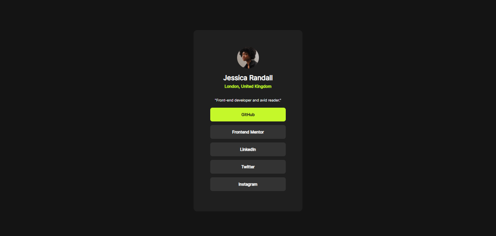

# Frontend Mentor - Social links profile solution

This is a solution to the [Social links profile challenge on Frontend Mentor](https://www.frontendmentor.io/challenges/social-links-profile-UG32l9m6dQ). Frontend Mentor challenges help you improve your coding skills by building realistic projects.

## Table of contents

- [Overview](#overview)
  - [The challenge](#the-challenge)
  - [Screenshot](#screenshot)
  - [Links](#links)
- [My process](#my-process)
  - [Built with](#built-with)
  - [What I learned](#what-i-learned)
  - [Continued development](#continued-development)
  - [Useful resources](#useful-resources)
- [Author](#author)
- [Acknowledgments](#acknowledgments)

**Note: Delete this note and update the table of contents based on what sections you keep.**

## Overview

### The challenge

Users should be able to:

- See hover and focus states for all interactive elements on the page.

### Screenshot

### Screenshot

### Links

- Solution URL: [Social Links Profile Solution](https://github.com/FrontEndExplorer-Temp/social-links-profile)
- Live Site URL: [Social Links Profile Live Site Link](https://frontendexplorer-temp.github.io/social-links-profile/)

## My process

### Built with

- Semantic HTML5 markup
- CSS custom properties
- Flexbox
- Mobile-first workflow

### What I learned

This project helped me deepen my understanding of:

- Custom fonts and how to integrate them using the `@font-face` rule.
- Hover states and focus effects for interactive elements using CSS pseudo-classes.
- Effective use of Flexbox for layout and alignment.
- Mobile-first design principles to ensure responsiveness.

### Continued development

In future projects, I aim to:

- Refine my skills in implementing hover and focus states to enhance interactivity.
- Explore advanced CSS techniques for creating smoother transitions and animations.
- Gain deeper knowledge of responsive web design to cater to a wider range of devices.
- Work on integrating JavaScript functionalities to add dynamic features.

### Useful resources

- [MDN Web Docs - @font-face](https://developer.mozilla.org/en-US/docs/Web/CSS/@font-face) - A comprehensive guide to using custom fonts in CSS.
- [CSS-Tricks - A Complete Guide to Flexbox](https://css-tricks.com/snippets/css/a-guide-to-flexbox/) - This helped me understand Flexbox better and how to use it for responsive layouts.
- [Frontend Mentor](https://www.frontendmentor.io/) - Their challenges help refine web development skills by working on realistic projects.

## Author

- GitHub - [FrontEndExplorer-Temp](https://github.com/FrontEndExplorer-Temp)
- Frontend Mentor - [@FrontEndExplorer-Temp](https://www.frontendmentor.io/profile/FrontEndExplorer-Temp)

## Acknowledgments

I would like to express my gratitude to:

- [Frontend Mentor](https://www.frontendmentor.io/) for providing engaging challenges that help developers improve their skills.
- The amazing developers in the Frontend Mentor community whose solutions and insights inspired me throughout the challenge.
- [MDN Web Docs](https://developer.mozilla.org/) for their detailed documentation on web development concepts.
- Friends and family who encouraged and supported me while working on this project.

Special thanks to anyone else who offered their advice or feedback along the way!
